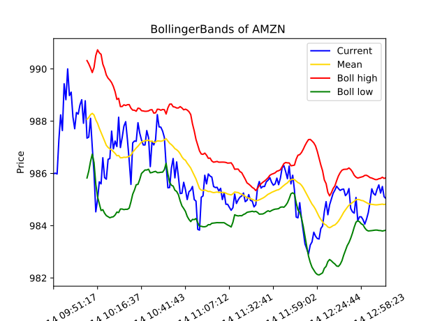
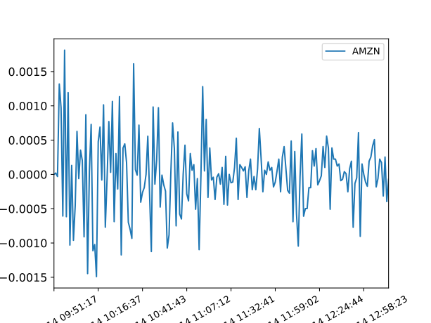
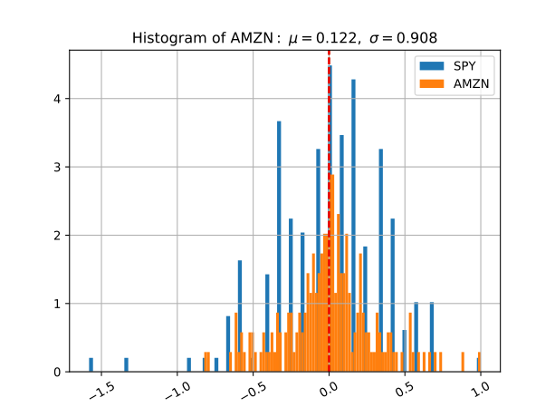
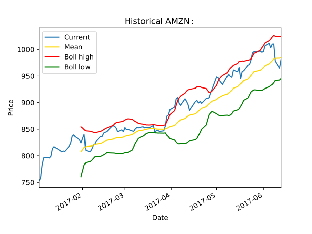
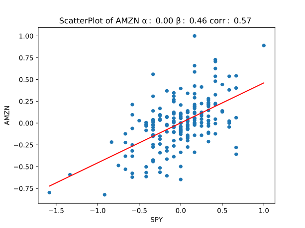
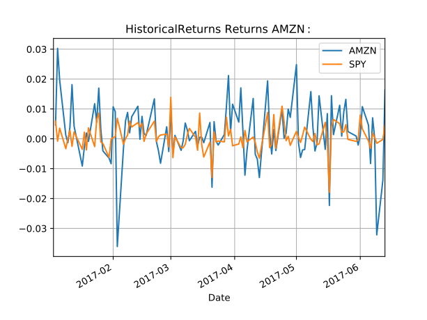

# StockPy

The StockPy project is an exploration into the use of machine learning to create an automated stock robot. It is incomplete, and steps are being added over time. Currently a porfolio (in Schwab CSV export format) is read, and then both realtime and historical data is used to analyse and plot the data. 

The algorithms used are adapted from the Udacity course 'Machine Learning for Trading'.

## Software Overview

There are two main modules:

1. currentquotes - reads the csv-formated portfolio of stocks and loops querying google finance to get current stock values. It then calls the stats.py module in two entry points: 

  - `dostats` - which performs intra-day statisitics and plots
  
  - `analyze_portfolio` - which performs historical stock data analysis and plots

2. dostats - uses pandas to do intra-day and historical statistics and plots

## Intra-day Statistics

The main entry point of `current_quotes` reads the stock profolio and then loops writing data to a CSV file of the stock data every 60 seconds. It then calls `dostats` on each stock in the portfolio and `analyze_portfolio` on the list  of stocks.

The function `dostats` uses pandas to read the CSV stock data file for a stock and an index to use as a comparison. The index currently used is **SPY** the Standard and Poors 500 index. It then performs the following analysis and produces a plot of the data:

1. Daily Bollinger Bands™

2. Daily Returns

3. Histogram of daily returns vs the index

4. Year-to-date historical comparison of returns against the index

5. Scatter plot of daily returns against the index

## Historical Statistics

The function `analyze_portfolio` analyzes the entire portfolio performance against the index. It calculates the normalized value of the portfolio, then calculates a rolling mean of the profolio against the index.

## Further Work

Next I hope to add deep learning algorithms to further explore the possibilities of the use of AI in stock data analysis.

| ***Sample plots*** |
|:-------------:|
|  |
| ***Bollinger Bands*** |
|  |
| ***Daily Returns*** |
|  |
| ***Histogram*** |
|  |
| ***YTD Returns*** |
|  |
| ***Scatter Plot*** |
|  |
| ***Returns History*** |

